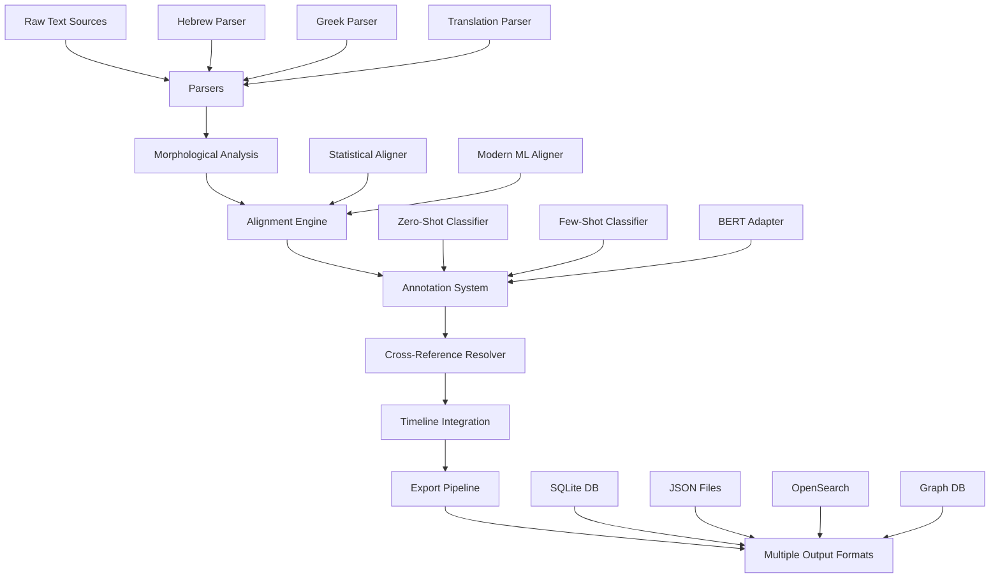

# ABBA Data Flow and Algorithms

## Table of Contents
1. [Overview](#overview)
2. [Data Processing Pipeline](#data-processing-pipeline)
3. [Core Algorithms](#core-algorithms)
4. [Data Flow Diagrams](#data-flow-diagrams)
5. [Processing Steps](#processing-steps)
6. [Algorithm Details](#algorithm-details)

## Overview

ABBA processes biblical texts through a sophisticated pipeline that combines linguistic analysis, machine learning, and structured data transformation. This document explains how data flows through the system and the algorithms used at each stage.

## Data Processing Pipeline



## Core Algorithms

### 1. Text Alignment Algorithm

The alignment system uses a hybrid approach combining statistical methods with modern machine learning:

```
┌─────────────────────────────────────────────────────────────┐
│                    Text Alignment Pipeline                   │
├─────────────────────────────────────────────────────────────┤
│                                                             │
│  1. Tokenization                                            │
│     ├─ Source: Hebrew/Greek morphological tokens           │
│     └─ Target: English word tokens                          │
│                           ↓                                 │
│  2. Strong's Number Mapping                                 │
│     ├─ Direct mapping via Strong's concordance             │
│     └─ Confidence: 0.9-1.0 for direct matches              │
│                           ↓                                 │
│  3. Statistical Alignment (IBM Model 2)                     │
│     ├─ Build translation probability table                  │
│     ├─ Apply EM algorithm for alignment                    │
│     └─ Confidence: 0.6-0.9 based on probability            │
│                           ↓                                 │
│  4. Neural Refinement                                       │
│     ├─ BERT contextual embeddings                          │
│     ├─ Cosine similarity scoring                           │
│     └─ Confidence: weighted ensemble                       │
│                           ↓                                 │
│  5. Validation & Output                                     │
│     ├─ Cross-translation consistency check                 │
│     └─ Final alignment with confidence scores              │
│                                                             │
└─────────────────────────────────────────────────────────────┘
```

#### Statistical Alignment Algorithm (IBM Model 2)

```python
# Pseudocode for alignment probability calculation
def calculate_alignment_probability(source_tokens, target_tokens):
    # Initialize translation probabilities
    trans_prob = defaultdict(lambda: defaultdict(float))
    alignment_prob = defaultdict(lambda: defaultdict(float))
    
    # Expectation-Maximization iterations
    for iteration in range(num_iterations):
        # E-step: Calculate expected alignments
        counts = defaultdict(float)
        total = defaultdict(float)
        
        for src_tokens, tgt_tokens in parallel_corpus:
            for t_idx, t_word in enumerate(tgt_tokens):
                z = sum(trans_prob[s_word][t_word] * 
                       alignment_prob[s_idx][t_idx] 
                       for s_idx, s_word in enumerate(src_tokens))
                
                for s_idx, s_word in enumerate(src_tokens):
                    prob = (trans_prob[s_word][t_word] * 
                           alignment_prob[s_idx][t_idx]) / z
                    counts[(s_word, t_word)] += prob
                    total[s_word] += prob
        
        # M-step: Update probabilities
        for s_word, t_word in counts:
            trans_prob[s_word][t_word] = counts[(s_word, t_word)] / total[s_word]
    
    return trans_prob, alignment_prob
```

### 2. Morphological Analysis Algorithm

The morphological analysis system decodes complex grammatical information:

```
┌─────────────────────────────────────────────────────────────┐
│              Morphological Analysis Pipeline                 │
├─────────────────────────────────────────────────────────────┤
│                                                             │
│  Hebrew Morphology Parsing:                                 │
│  ┌─────────────────────────────────────┐                   │
│  │ Input: "Ncmpc" (morphology code)    │                   │
│  │         ↓                            │                   │
│  │ Decode: N = Noun                    │                   │
│  │         c = common gender           │                   │
│  │         m = masculine               │                   │
│  │         p = plural                  │                   │
│  │         c = construct state         │                   │
│  │         ↓                            │                   │
│  │ Output: {                           │                   │
│  │   pos: "noun",                      │                   │
│  │   gender: "masculine",              │                   │
│  │   number: "plural",                 │                   │
│  │   state: "construct"                │                   │
│  │ }                                   │                   │
│  └─────────────────────────────────────┘                   │
│                                                             │
│  Greek Morphology Parsing:                                  │
│  ┌─────────────────────────────────────┐                   │
│  │ Input: "V-PAI-3S"                   │                   │
│  │         ↓                            │                   │
│  │ Decode: V = Verb                    │                   │
│  │         P = Present tense           │                   │
│  │         A = Active voice            │                   │
│  │         I = Indicative mood         │                   │
│  │         3 = 3rd person              │                   │
│  │         S = Singular                │                   │
│  │         ↓                            │                   │
│  │ Output: {                           │                   │
│  │   pos: "verb",                      │                   │
│  │   tense: "present",                 │                   │
│  │   voice: "active",                  │                   │
│  │   mood: "indicative",               │                   │
│  │   person: "3rd",                    │                   │
│  │   number: "singular"                │                   │
│  │ }                                   │                   │
│  └─────────────────────────────────────┘                   │
│                                                             │
└─────────────────────────────────────────────────────────────┘
```

### 3. Annotation Generation Algorithm

The annotation system uses multiple ML approaches:

```
┌─────────────────────────────────────────────────────────────┐
│              Annotation Generation Pipeline                  │
├─────────────────────────────────────────────────────────────┤
│                                                             │
│  Input: Verse Text + Context                               │
│                    ↓                                        │
│  ┌─────────────────────────────────────┐                   │
│  │    1. Zero-Shot Classification      │                   │
│  │    ├─ Model: facebook/bart-large    │                   │
│  │    ├─ Candidate labels              │                   │
│  │    └─ Confidence threshold: 0.7     │                   │
│  └─────────────────────────────────────┘                   │
│                    ↓                                        │
│  ┌─────────────────────────────────────┐                   │
│  │    2. Few-Shot Enhancement          │                   │
│  │    ├─ Retrieve similar examples     │                   │
│  │    ├─ Apply pattern matching        │                   │
│  │    └─ Adjust confidence scores      │                   │
│  └─────────────────────────────────────┘                   │
│                    ↓                                        │
│  ┌─────────────────────────────────────┐                   │
│  │    3. BERT Contextual Analysis      │                   │
│  │    ├─ Extract contextual embeddings │                   │
│  │    ├─ Cluster similar concepts      │                   │
│  │    └─ Identify semantic themes      │                   │
│  └─────────────────────────────────────┘                   │
│                    ↓                                        │
│  ┌─────────────────────────────────────┐                   │
│  │    4. Quality Control               │                   │
│  │    ├─ Cross-validate annotations    │                   │
│  │    ├─ Apply confidence thresholds   │                   │
│  │    └─ Human-in-the-loop option     │                   │
│  └─────────────────────────────────────┘                   │
│                    ↓                                        │
│  Output: Structured Annotations with Confidence Scores     │
│                                                             │
└─────────────────────────────────────────────────────────────┘
```

### 4. Cross-Reference Detection Algorithm

```python
# Cross-reference detection algorithm
def detect_cross_references(source_verse, target_corpus):
    references = []
    
    # 1. Exact quote detection
    source_tokens = tokenize(source_verse.text)
    for target_verse in target_corpus:
        target_tokens = tokenize(target_verse.text)
        
        # Check for exact matches (minimum 3 tokens)
        matches = find_longest_common_subsequences(
            source_tokens, target_tokens, min_length=3
        )
        
        if matches:
            confidence = len(matches[0]) / len(source_tokens)
            references.append({
                'target': target_verse.id,
                'type': 'QUOTE',
                'confidence': min(confidence * 1.2, 1.0)
            })
    
    # 2. Allusion detection using semantic similarity
    source_embedding = get_verse_embedding(source_verse)
    
    for target_verse in target_corpus:
        target_embedding = get_verse_embedding(target_verse)
        similarity = cosine_similarity(source_embedding, target_embedding)
        
        if similarity > 0.8:
            # Check for shared key terms
            shared_terms = get_shared_key_terms(source_verse, target_verse)
            
            if len(shared_terms) >= 2:
                references.append({
                    'target': target_verse.id,
                    'type': 'ALLUSION',
                    'confidence': similarity * 0.9
                })
    
    # 3. Thematic parallel detection
    source_themes = extract_themes(source_verse)
    
    for target_verse in target_corpus:
        target_themes = extract_themes(target_verse)
        theme_overlap = jaccard_similarity(source_themes, target_themes)
        
        if theme_overlap > 0.6:
            references.append({
                'target': target_verse.id,
                'type': 'PARALLEL',
                'confidence': theme_overlap
            })
    
    return deduplicate_and_rank(references)
```

### 5. Timeline Processing Algorithm

The timeline system handles BCE dates and uncertainty:

```
┌─────────────────────────────────────────────────────────────┐
│              Timeline Processing Algorithm                   │
├─────────────────────────────────────────────────────────────┤
│                                                             │
│  BCE Date Encoding:                                         │
│  ┌─────────────────────────────────────┐                   │
│  │ Input: 1446 BCE                     │                   │
│  │         ↓                            │                   │
│  │ Encode: year = 5000 - 1446 = 3554   │                   │
│  │ (Python datetime compatible)        │                   │
│  │         ↓                            │                   │
│  │ Store: datetime(3554, 1, 1)         │                   │
│  │ Metadata: {"bce": true, "original": 1446}              │
│  └─────────────────────────────────────┘                   │
│                                                             │
│  Uncertainty Modeling:                                      │
│  ┌─────────────────────────────────────┐                   │
│  │ Exact date: confidence = 1.0        │                   │
│  │ Year only: confidence = 0.9         │                   │
│  │ Decade: confidence = 0.7            │                   │
│  │ Century: confidence = 0.5           │                   │
│  │ Disputed: confidence < 0.5          │                   │
│  └─────────────────────────────────────┘                   │
│                                                             │
│  Temporal Graph Construction:                               │
│  ┌─────────────────────────────────────┐                   │
│  │ Nodes: Events, Periods              │                   │
│  │ Edges: BEFORE, AFTER, DURING        │                   │
│  │ Weights: Confidence scores          │                   │
│  │         ↓                            │                   │
│  │ Apply: Topological sort for         │                   │
│  │         chronological ordering      │                   │
│  └─────────────────────────────────────┘                   │
│                                                             │
└─────────────────────────────────────────────────────────────┘
```

## Data Flow Diagrams

### Main Processing Flow

```
┌─────────────┐     ┌─────────────┐     ┌─────────────┐
│   Source    │────▶│   Parser    │────▶│ Normalizer  │
│   Files     │     │             │     │             │
└─────────────┘     └─────────────┘     └─────────────┘
                                               │
                                               ▼
┌─────────────┐     ┌─────────────┐     ┌─────────────┐
│  Enriched   │◀────│  Enricher   │◀────│ Validator   │
│   Data      │     │             │     │             │
└─────────────┘     └─────────────┘     └─────────────┘
       │
       ├────────────────┬────────────────┬────────────────┐
       ▼                ▼                ▼                ▼
┌─────────────┐  ┌─────────────┐  ┌─────────────┐  ┌─────────────┐
│   SQLite    │  │    JSON     │  │ OpenSearch  │  │  Graph DB   │
│  Exporter   │  │  Exporter   │  │  Exporter   │  │  Exporter   │
└─────────────┘  └─────────────┘  └─────────────┘  └─────────────┘
```

### Alignment Processing Detail

```
Hebrew Text                     English Text
"בְּרֵאשִׁית בָּרָא"           "In the beginning God created"
     │                                │
     ▼                                ▼
┌─────────────┐                 ┌─────────────┐
│  Tokenizer  │                 │  Tokenizer  │
└─────────────┘                 └─────────────┘
     │                                │
     ▼                                ▼
[בְּרֵאשִׁית] [בָּרָא]          [In] [the] [beginning] [God] [created]
     │                                │
     └────────────┬───────────────────┘
                  ▼
         ┌─────────────────┐
         │ Alignment Model │
         │ (Statistical +  │
         │  Neural)        │
         └─────────────────┘
                  │
                  ▼
         Alignment Matrix:
         בְּרֵאשִׁית → "In the beginning" (0.95)
         בָּרָא → "created" (0.98)
         (implied) → "God" (0.85)
```

## Processing Steps

### Step 1: Input Processing
1. **File Detection**: Identify input format (XML, JSON, TXT)
2. **Encoding Detection**: Handle UTF-8, UTF-16, legacy encodings
3. **Structure Validation**: Ensure well-formed data

### Step 2: Parsing
1. **Language Detection**: Hebrew, Greek, or translation
2. **Token Extraction**: Words, punctuation, markers
3. **Metadata Preservation**: Maintain source references

### Step 3: Morphological Analysis
1. **Code Parsing**: Decode morphology strings
2. **Feature Extraction**: POS, gender, number, tense, etc.
3. **Lemmatization**: Extract base forms

### Step 4: Alignment
1. **Preparation**: Build parallel corpus
2. **Statistical Alignment**: IBM Model 2 with EM
3. **Neural Enhancement**: BERT-based refinement
4. **Validation**: Cross-translation consistency

### Step 5: Annotation
1. **Text Classification**: Zero-shot with candidate labels
2. **Example Matching**: Few-shot learning
3. **Contextual Analysis**: BERT embeddings
4. **Quality Control**: Confidence thresholding

### Step 6: Cross-Reference Resolution
1. **Quote Detection**: Exact string matching
2. **Allusion Finding**: Semantic similarity
3. **Parallel Identification**: Thematic analysis
4. **Ranking**: Confidence-based ordering

### Step 7: Export
1. **Format Selection**: Based on configuration
2. **Data Transformation**: Convert to target schema
3. **Optimization**: Indices, compression
4. **Validation**: Output verification

## Algorithm Details

### Confidence Score Calculation

The system uses ensemble confidence scoring:

```python
def calculate_ensemble_confidence(alignments):
    """
    Weighted ensemble of multiple confidence signals
    """
    weights = {
        'strongs': 0.35,      # Direct Strong's number match
        'statistical': 0.25,   # Statistical alignment probability
        'neural': 0.25,       # Neural model similarity
        'syntactic': 0.15    # Syntactic pattern matching
    }
    
    confidence = 0.0
    for method, score in alignments.items():
        if method in weights:
            confidence += weights[method] * score
    
    # Apply penalties
    if alignments.get('length_ratio', 1.0) > 2.0:
        confidence *= 0.8  # Penalty for very different lengths
    
    if alignments.get('cross_validation', 1.0) < 0.7:
        confidence *= 0.9  # Penalty for inconsistent alignments
    
    return min(confidence, 1.0)
```

### Semantic Loss Detection

The system identifies potential meaning loss in translation:

```python
def detect_semantic_loss(source_analysis, target_text):
    """
    Identify potential semantic loss in translation
    """
    losses = []
    
    # Check for untranslated concepts
    source_concepts = extract_semantic_concepts(source_analysis)
    target_concepts = extract_concepts_from_text(target_text)
    
    for concept in source_concepts:
        if not find_concept_in_target(concept, target_concepts):
            losses.append({
                'type': 'UNTRANSLATED_CONCEPT',
                'concept': concept,
                'severity': calculate_concept_importance(concept)
            })
    
    # Check for grammatical feature loss
    source_features = extract_grammatical_features(source_analysis)
    
    for feature in source_features:
        if feature['type'] in ['aspect', 'voice', 'mood']:
            if not is_feature_expressed(feature, target_text):
                losses.append({
                    'type': 'GRAMMATICAL_FEATURE_LOSS',
                    'feature': feature,
                    'severity': 0.6
                })
    
    return losses
```

### Performance Optimization

Key optimization strategies:

1. **Caching**: LRU cache for repeated computations
2. **Batch Processing**: Process multiple verses together
3. **Lazy Loading**: Load models on-demand
4. **Parallel Processing**: Multi-threaded parsing
5. **Index Optimization**: Pre-computed search indices

## Next Steps

For detailed usage instructions, see [USER_GUIDE.md](USER_GUIDE.md).
For API documentation, see [API.md](API.md).